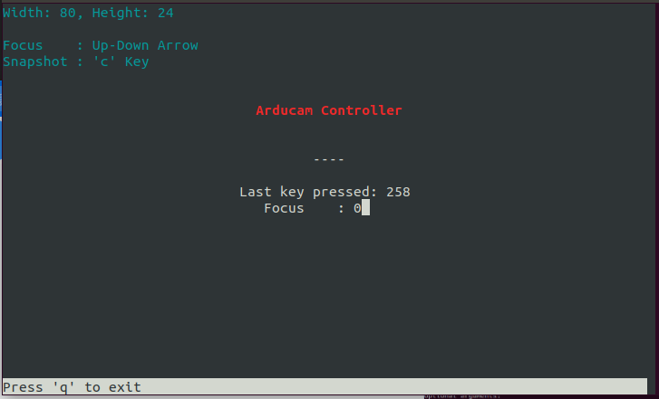

# Motorized_Focus_Camera
## Preparation
## Demos Function
 Arducam has release three demos Motorized_Focus_Camera_Preview.py, Motorized_Focus_Camera_Snapshot.py and Autofocus.py 
  - Before running this demo, you have to install Python Dependency libraries.
 ```Bash
python3 -m pip install opencv-python    
sudo apt-get install libatlas-base-dev
python3 -m pip install -U numpy 
 ```
```bash
sudo chmod +x enable_i2c_vc.sh
```
```bash
./enable_i2c_vc.sh
```
Press Y to reboot

```Bash
git clone https://github.com/ArduCAM/RaspberryPi.git
```

### Motorized_Focus_Camera_Preview.py
 - This demo supports focusing in preview mode, You can see the focus visually
 - Single focus by keyboard up and down
 - Run this demo is very easy , just input the "python3 Motorized_Focus_Camera_Preview.py" in the terminal.
### AutofocusTest.py 
 - This demo supports auto focusing in preview mode, You can see the focus visually
 - Run the demo by inputing the "python3 AutofocusTest.py" in the terminal.


### Usage:

## Python demo
```bash
cd RaspberryPi/Motorized_Focus_Camera/python/
```

## Install libcamera

### python 2.7

```bash
python -m pip install ./libcamera-1.0.2-cp27-cp27mu-linux_armv7l.whl
```

### python 3.9

```bash
python3 -m pip install ./libcamera-1.0.2-cp39-cp39-linux_armv7l.whl
```

* FocuserExample.py Example of manual focus  
```bash 
python FocuserExample.py -i 10
```
Screenshot:  
  

* AutofocusTest.py Example of autofocus  
Click the 'F' button to achieve auto focus, click the 'Q' button to exit and save the picture

```bash 
python3 AutofocusTest.py -i 10
```

## C demo

```bash
cd RaspberryPi/Motorized_Focus_Camera/C/
```
```bash
make install
```
```bash
make 
```
```bash
./manualFocus
```
