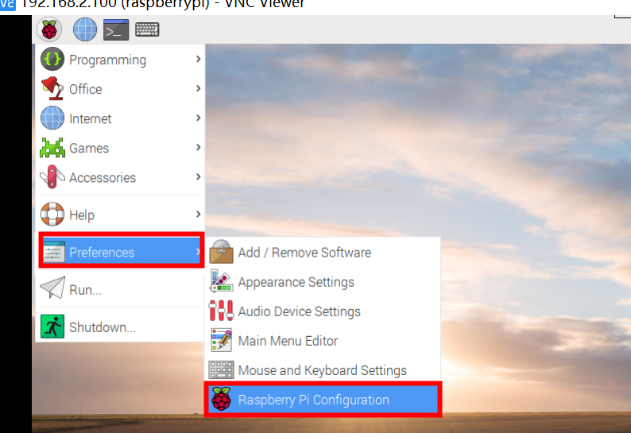
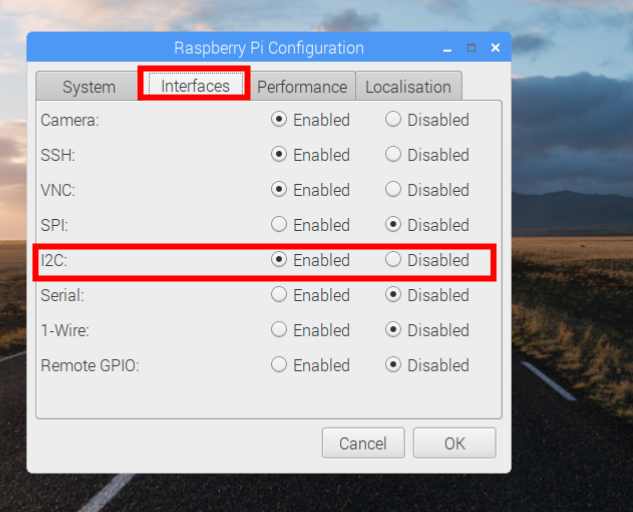
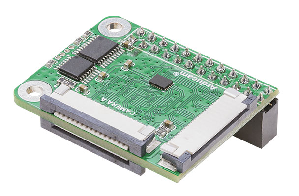
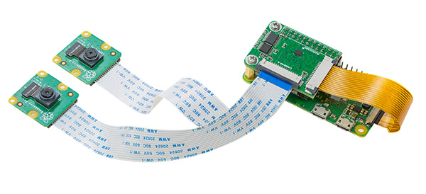

## Introudction
This multi-camera adapter board is designed for Raspberry pi ZERO and let your connect two 8MP cameras to Pi Zero.
Only one of the two cameras can be activated at a time, the are working in alternate ways.
It can not run two cameras at the same time, but we build a simple software which can run two cameras and make it looks working as the same time.
But the drawback is the frame rate and resolution will be fairly low, may be useful for surveillance.
## Prerequisites.
Before using this board, you should enable the i2c1 firstly.


## Hardware pin definition

| Pi Zero| Adapter Board |
| :--- | :---: |
| SDA1 | SDA | 
| SCL1 | SCL | 
| 7    | SEL |
| 11   | OE  |
| 3.3V | 3V3 |
| GND  | GND |
- User should choose the channel through the i2c bus.
* Choose the cameraA
```Bash
 sudo i2cset -y 1 0x70 0x00 0x01
```
* CHoose the cameraB
```Bash
 sudo i2cset -y 1 0x70 0x00 0x02
```
- User should set the 11 (OE signal) to low to enabe the mipi data output.
- User should set the 7 (SEL) high and low to choose cut the cameraA and cameraB 

## Hardware Connection



## Quickly start
- Download the Raspberrypi library
```bash
git clone https://github.com/ArduCAM/RaspberryPi.git
```

- This example demonstrates to run two cameras and make them looks at the same time
## Add support for Pi4 B
- Just a quick post to let you know that you’ll need a new wiringPi for the Raspberry Pi 4B.
- To upgrade:
```bash
cd /tmp
```
```bash
wget https://project-downloads.drogon.net/wiringpi-latest.deb
```
```bash
sudo dpkg -i wiringpi-latest.deb
```
### Shell version
- This shell script demonstrates how to take two still images from two cameras in turn. Each camera will preview for 5 seconds
- take a photo saved to the local file system. Users can directly see the tested pictures. 
- Run the script
```bash
cd RaspberryPi/Multi_Camera_Adapter/Multi_Adapter_Board_2Channel_uc444/shell
```
```bash
sudo chmod +x pi_cam_uc444.sh
```
```bash
sudo ./pi_cam_uc444.sh
```

### C++ version
* Install the opencv library
```Bash
sudo apt-get install libopencv-dev
```
* Compile and run
```Bash
cd RaspberryPi/Multi_Camera_Adapter/Multi_Adapter_Board_2Channel_uc444
```
```Bash
make
```
* For the use of remote control terminals, first specify the location of the image display
```Bash
export DISPLAY=:0
```
```Bash
sudo ./arducam_multi_adapter_uc444
```
* For users who directly operate locally
```Bash
sudo ./arducam_multi_adapter_uc444
```


